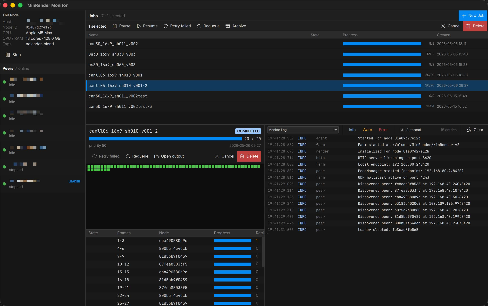

# MinRender

A lightweight render farm coordinator for small VFX teams and freelancers.



- **Self-healing mesh** — every node can act as coordinator. If the leader drops, another takes over automatically.
- **DCC agnostic** — JSON templates define how to launch any renderer. Ships with Blender, Cinema 4D, and After Effects templates + submission plugins.
- **Simple setup** — install, point every node at a shared folder, done.
- **Fast discovery** — UDP multicast for LAN, falls back to a file-system phonebook for VPNs and complex networks.
- **HTTP coordination** — job dispatch, progress tracking, and completion reporting over an HTTP mesh.
- **Local staging** — opt-in render-to-local-then-copy mode to prevent file corruption from cloud sync tools (Synology Drive, Dropbox, etc.).
- **Resilient** — each node keeps a SQLite snapshot of the leader's state. If the leader drops, a new one picks up where it left off. Worst case: frames rendered in the last 30 seconds get re-rendered.
- **Windows and macOS supported**

Built with C++ (Qt 6 Quick / QML) and Rust.

## Install + docs

Grab the latest installer from the [releases page](https://github.com/cbkow/minrender/releases) and head to **[minrender.com](https://minrender.com)** for the full manual — install, configuration, job submission, monitoring, and the job template reference.

## Build from source

Requirements: CMake ≥ 3.21, Qt 6.11 (Quick / QML / Widgets / Network), a recent Rust toolchain.

```sh
cmake -S . -B build -DCMAKE_PREFIX_PATH=/path/to/Qt/6.11.1/<platform>
cmake --build build --target minrender -j8
```

The macOS release script (signs + notarizes + builds a DMG) is at `scripts/macos-release.sh`. The Windows installer is built with Inno Setup from `installer/minrender_installer.iss` after `scripts/build_msvc.bat`.

## License

See [LICENSE](LICENSE).
